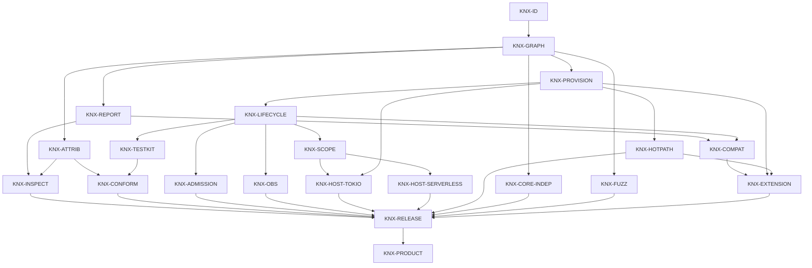

# Kernox identity graph

This file is the canonical identity graph for the destination owned by
[`docs/vision.md`](vision.md). It includes every Kernox identity required to
reach that destination whether or not the current source revision has
implemented or admitted it. Implementation evidence is subordinate to the
graph; missing evidence never removes an identity from the product.

The table is the authority. The picture uses the same IDs and the same
Depends-on edges. A picture that omits or invents an edge is a defect.

| Home | Owns |
| --- | --- |
| [`docs/vision.md`](vision.md) | Canonical destination, users, boundaries, and maturity |
| This file | `KNX-*` identities, fates, truth-edges, and done-when oracles |
| [`docs/prd.md`](prd.md) | Detailed KR-* requirements, invariants, non-goals, and release criteria |
| [`docs/specs/20260815T185400Z-runtime-contract.md`](specs/20260815T185400Z-runtime-contract.md) | Identifier, resolution, provision, lifecycle, scope, and Host semantics |
| [`docs/specs/20260815T185400Z-acceptance.md`](specs/20260815T185400Z-acceptance.md) | Detailed release claims and validation lanes |
| [`docs/adr/20260815T185400Z-static-capability-graph.md`](adr/20260815T185400Z-static-capability-graph.md) | Why the static graph is the kernel authority |

## How to read the graph

- **Identity** is one durable name. One colloquial name has one row.
- **Fate** is `live`, `dead`, or `rename-to:<ID>`. Every current `KNX-*`
  identity is `live`.
- **Depends on** is a truth edge: B cannot be correct before A is done or A's
  contract is locked. Roadmap order is not an edge.
- **Done when** is a cheap observable oracle. It does not assert that the
  current revision passes it. Status belongs on product PRs, not in this table.
- Source, CI, merge, package publication, registry readback, product adoption,
  and live use remain separate evidence layers.
- `KNX-EX-*` labels identify revision-local evidence compositions below. They
  are not product identities.
- Native Plugins are trusted in-process code. Nothing in this graph is a
  sandbox or a service locator.

## Identity graph

Edges point from prerequisite to dependent. Every live identity converges on
`KNX-PRODUCT`, the first admitted Kernox product release.

## Identity register

| ID | Identity | Fate | Depends on | Done when |
| --- | --- | --- | --- | --- |
| `KNX-ID` | Stable validated Plugin and Capability identities, semantic versions, requirements, offers, conflicts, attribution, and bounded metadata | live | — | Malformed, duplicate, oversized, or self-conflicting descriptors fail with typed stable tags |
| `KNX-GRAPH` | Pure deterministic provider selection, explicit bindings, cardinalities, conflicts, hard limits, cycles, and dependency order | live | `KNX-ID` | Equivalent descriptor permutations resolve to the same graph and invalid compositions fail before any Plugin hook runs |
| `KNX-REPORT` | Independently versioned graph projection with selected edges, diagnostics, startup order, and exact reverse teardown order | live | `KNX-GRAPH` | Semantic round trips are stable; unsupported majors and inconsistent or referentially invalid projections fail closed |
| `KNX-ATTRIB` | Verified-application source attribution over the resolved graph | live | `KNX-GRAPH` | Insufficient, missing, or duplicate source-package attribution fails with the same tags in core inspection and conformance |
| `KNX-INSPECT` | Bounded CLI validation and DOT/JSON rendering from the same graph authority | live | `KNX-REPORT`, `KNX-ATTRIB` | CLI and core agree on valid, invalid, and verified compositions; untrusted input exceeds no declared bound |
| `KNX-PROVISION` | Declared-only typed dependency access and atomic publication of complete provisions | live | `KNX-GRAPH` | Undeclared, wrong-cardinality, missing, duplicate, version-, or type-mismatched access fails before readiness; the resolver borrow cannot escape |
| `KNX-LIFECYCLE` | Transactional initialize/start, deterministic readiness, reverse rollback, quiesce/stop/dispose, unwind isolation, and idempotent shutdown | live | `KNX-PROVISION` | Failure injection across every phase preserves the primary failure, continues reverse cleanup, publishes no partial state, and repeats no terminal effect |
| `KNX-ADMISSION` | One explicit boundary that closes new application work and root capability acquisition before cleanup | live | `KNX-LIFECYCLE` | New work fails once quiesce begins; previously acquired direct handles remain a documented non-revocable residual |
| `KNX-SCOPE` | Host-neutral application/invocation identity, parentage, closure, and lifetime containment | live | `KNX-LIFECYCLE` | Concurrent invocations receive distinct children, closed parents reject registration, and supported APIs cannot leak invocation views |
| `KNX-OBS` | Privacy-safe typed lifecycle observations without a telemetry SDK in core | live | `KNX-LIFECYCLE` | Stable identities, phases, outcomes, durations, and error tags are emitted without arbitrary payloads; a sink failure cannot abort lifecycle cleanup |
| `KNX-TESTKIT` | Deterministic, duration-free lifecycle recording and typed fault injection | live | `KNX-LIFECYCLE` | Tests can falsify order and every partial-success boundary without network, process signals, or wall-clock sleeps |
| `KNX-CONFORM` | One application conformance oracle over a resolved graph, attribution, real startup, and clean shutdown | live | `KNX-ATTRIB`, `KNX-TESTKIT` | Too-small, unattributed, or dirty-shutdown applications cannot produce a conformance report |
| `KNX-HOST-TOKIO` | Official long-lived Tokio task supervision with named admission, cancellation, bounded drain, forced abort, and fail-closed panic reporting | live | `KNX-SCOPE`, `KNX-PROVISION` | Cooperative, stubborn, panicking, over-capacity, and missing-runtime tasks reach typed deterministic terminals without surviving shutdown |
| `KNX-HOST-SERVERLESS` | Provider-neutral warm application reuse with isolated invocation scopes, bounded concurrency, and explicit shutdown admission | live | `KNX-SCOPE` | Concurrent calls share no request state, handler failure leaks no invocation, and post-shutdown admission fails |
| `KNX-HOTPATH` | Direct typed application handles after readiness, with no graph, registry, serialization, or event hop | live | `KNX-PROVISION` | API-shape review and representative benchmarks show ordinary calls remain direct and within the accepted steady-state budget |
| `KNX-CORE-INDEP` | Core independence from Hosts, async runtimes, transports, providers, telemetry SDKs, I/O, and product-domain policy | live | `KNX-GRAPH` | Minimal-feature compilation and dependency-graph checks reject any forbidden runtime, Host, or product edge |
| `KNX-FUZZ` | Bounded fail-closed handling of untrusted composition input and pathological graphs | live | `KNX-GRAPH` | Property and fuzz lanes cover parser bounds, graph limits, and adversarial shapes without panic or unbounded work |
| `KNX-COMPAT` | Source, capability, schema, diagnostic, deprecation, and Host-capability compatibility across releases | live | `KNX-REPORT`, `KNX-LIFECYCLE` | Public API comparison uses the admitted predecessor; old supported fixtures remain readable, unsupported majors fail closed, deprecations retain a replacement window, and unmet Host properties fail before readiness |
| `KNX-EXTENSION` | Native-first extension ladder whose future process or WebAssembly boundaries preserve Kernox semantics without weakening the native path | live | `KNX-COMPAT`, `KNX-PROVISION`, `KNX-HOTPATH` | The ladder names native static composition as the first rung and keeps it direct; an alternate rung is optional, but cannot be admitted until its ABI/WIT, grants, resources, migration, failure isolation, and conformance are executable and versioned |
| `KNX-RELEASE` | Reproducible commercial release discipline for the complete package train | live | `KNX-INSPECT`, `KNX-CONFORM`, `KNX-ADMISSION`, `KNX-OBS`, `KNX-HOST-TOKIO`, `KNX-HOST-SERVERLESS`, `KNX-HOTPATH`, `KNX-CORE-INDEP`, `KNX-FUZZ`, `KNX-EXTENSION` | One exact tagged SHA passes locked verification, compatibility, docs, security, dependency/license/advisory, fuzz, benchmark, package, provenance, and reference paths; every immutable package is then published in dependency order and registry readback matches its exact name, version, non-yanked state, and package checksum |
| `KNX-PRODUCT` | Terminal first production release of the Kernox destination | live | `KNX-RELEASE` | One immutable receipt binds every upstream oracle to the same source SHA, lockfile, toolchain, package set, checksums, and successful registry readback; no local, PR, merge, tag, dry-run, or partial publication can substitute |

## Requirements traceability

| PRD requirement | Identity ownership |
| --- | --- |
| KR-001 | `KNX-ID` |
| KR-002 | `KNX-GRAPH`, `KNX-REPORT` |
| KR-003 | `KNX-PROVISION`, `KNX-HOTPATH` |
| KR-004 | `KNX-LIFECYCLE`, `KNX-ADMISSION` |
| KR-005 | `KNX-SCOPE`, `KNX-HOST-TOKIO` |
| KR-006 | `KNX-HOST-TOKIO`, `KNX-HOST-SERVERLESS`, `KNX-TESTKIT`, `KNX-INSPECT` |
| KR-007 | `KNX-REPORT`, `KNX-OBS` |
| KR-008 | `KNX-ATTRIB`, `KNX-INSPECT`, `KNX-TESTKIT`, `KNX-CONFORM` |
| KR-009 | `KNX-COMPAT`, `KNX-EXTENSION` |
| KR-010 | `KNX-RELEASE`, `KNX-PRODUCT` |

## Revision-local implementation evidence

This section records useful evidence in the current source tree. It does not
define the identity graph and cannot turn an unmet destination oracle into an
absent identity.

### Commit-build evidence

`cargo run --locked -p xtask -- verify` exercises the currently implemented
identity, graph, provisioning, lifecycle, scope, observation, testkit, Hosts,
inspection, conformance, direct-call, core-boundary, dependency-policy,
advisory, package, and reference-application paths. Extended fuzz, mutation,
performance-distribution, semantic-version, publication, and registry-readback
lanes remain separate evidence.

| Area | Current executable evidence |
| --- | --- |
| Deterministic graph | `cargo test --locked -p kernox-core --all-features graph` |
| Typed provisioning and lifecycle | `cargo test --locked -p kernox-runtime --all-features --test lifecycle` |
| Tokio supervision | `cargo test --locked -p kernox-host-tokio --all-features --test supervision` |
| Warm serverless isolation | `cargo test --locked -p kernox-host-serverless --all-features --test invocations` |
| Conformance | `cargo test --locked -p kernox-testkit --all-features --test conformance` |
| Inspection | `cargo run --locked -p cargo-kernox -- kernox check fixtures/compositions/verified.json --verified` |
| Release source checks | `cargo run --locked -p xtask -- release-check --version <workspace-version>` |
| Registry terminal mechanism | `.github/workflows/release.yml` publishes the package DAG and compares crates.io name, version, yanked state, and checksum with the built artifacts |

Schema and resource constants on this source revision:

| Contract | Value |
| --- | --- |
| `COMPOSITION_SCHEMA_VERSION` | `1` |
| `GRAPH_REPORT_SCHEMA_VERSION` | `1` |
| Default `GraphLimits` | 4,096 Plugins / 512 declarations per Plugin / 131,072 edges |
| Absolute ceilings | 65,536 / 4,096 / 1,048,576 |
| `MINIMUM_VERIFIED_PLUGINS` | `3` |
| `cargo kernox` input bound | 16 MiB |
| Fuzz target input bound | 1 MiB |

### Evidence compositions

| Evidence ID | Composition | What it exercises |
| --- | --- | --- |
| `KNX-EX-ORDER` | `examples/order-app` | One three-Plugin domain graph used unchanged by long-lived, serverless, and conformance paths |
| `KNX-EX-CHECKOUT` | `examples/checkout-app` | An explicit binding selects one of two compatible payment providers |
| `KNX-EX-WORKER` | `examples/worker-app` | A worker requires the official Tokio task capability and drains on shutdown |
| `KNX-EX-CONSUMER` | `fixtures/clean-consumer` | An out-of-workspace typed consumer exercises direct, workload, serverless, `all`, and `optional` paths |

### Destination evidence frontier

- `KNX-COMPAT` remains in the graph while stable 1.x compatibility and complete
  Host-capability negotiation lack admitted executable evidence.
- `KNX-EXTENSION` currently admits only the native static rung; no
  out-of-process or WebAssembly implementation is claimed or required merely to
  name the ladder. Its pre-admission contract binds any future rung.
- `KNX-RELEASE` remains in the graph while release automation has no admitted
  production registry-readback receipt for this product terminal.
- `KNX-PRODUCT` is therefore not admitted. A source pass, green CI, merge,
  tag, package dry-run, or partial registry publication cannot close it.
